# Food Access Analysis 

## Setup and Data Review


```python
# Import libraries 
import pandas as pd
import numpy as np
import matplotlib.pyplot as plt
import seaborn as sns

# Set Vis style
sns.set_style("whitegrid")
plt.rcParams["figure.figsize"] = (10, 6)

# Load the cleaned data
path = r'C:\Users\mahfo\Documents\portfolio\Data\FD3.csv'
FD = pd.read_csv(path)
# Display basic info about the dataset
print("Dataset Info:")
print(FD.info())

# Preview the first few rows
print("\nFirst 5 Rows of Dataset:")
print(FD.head())
```

    Dataset Info:
    <class 'pandas.core.frame.DataFrame'>
    RangeIndex: 72531 entries, 0 to 72530
    Data columns (total 27 columns):
     #   Column                      Non-Null Count  Dtype  
    ---  ------                      --------------  -----  
     0   Tract_ID                    72531 non-null  int64  
     1   fipscode                    72531 non-null  int64  
     2   State                       72531 non-null  object 
     3   County                      72531 non-null  object 
     4   Urban_Status                72531 non-null  object 
     5   LowFoodAccess               72531 non-null  object 
     6   Total_Population            72531 non-null  int64  
     7   LowAccess_Pop               72531 non-null  float64
     8   LowIncome_Pop               72531 non-null  float64
     9   LowIncome&_LowAccess_Pop    72531 non-null  float64
     10  NoVehicle_HHs               72531 non-null  float64
     11  SNAP_HHs                    72531 non-null  float64
     12  Poverty_Rate                72531 non-null  float64
     13  Median_Income               72531 non-null  float64
     14  LowAccess_Ratio             72531 non-null  float64
     15  LowIncome&_LowAccess_Ratio  72531 non-null  float64
     16  Pct_LowIncome_              72531 non-null  float64
     17  NoVehicle_HHs_Ratio         72531 non-null  float64
     18  SNAP_Participatio_Rate      72531 non-null  float64
     19  premature_death             72531 non-null  float64
     20  poor_health                 72531 non-null  float64
     21  low_birthweight             72531 non-null  float64
     22  obesity                     72531 non-null  float64
     23  diabetes                    72531 non-null  float64
     24  unemployment                72531 non-null  float64
     25  child_poverty               72531 non-null  float64
     26  income_inequality           72531 non-null  float64
    dtypes: float64(20), int64(3), object(4)
    memory usage: 14.9+ MB
    None
    
    First 5 Rows of Dataset:
         Tract_ID  fipscode    State          County Urban_Status LowFoodAccess  \
    0  1001020100      1001  Alabama  Autauga County        Urban            NO   
    1  1001020200      1001  Alabama  Autauga County        Urban           YES   
    2  1001020300      1001  Alabama  Autauga County        Urban            NO   
    3  1001020400      1001  Alabama  Autauga County        Urban            NO   
    4  1001020500      1001  Alabama  Autauga County        Urban            NO   
    
       Total_Population  LowAccess_Pop  LowIncome_Pop  LowIncome&_LowAccess_Pop  \
    0              1912         1896.0          455.0                     461.0   
    1              2170         1261.0          802.0                     604.0   
    2              3373         1552.0         1306.0                     478.0   
    3              4386         1363.0          922.0                     343.0   
    4             10766         2643.0         2242.0                     586.0   
    
       ...  NoVehicle_HHs_Ratio  SNAP_Participatio_Rate  premature_death  \
    0  ...             0.003138                0.053347           9778.1   
    1  ...             0.041014                0.071889           9778.1   
    2  ...             0.029351                0.050993           9778.1   
    3  ...             0.004788                0.022344           9778.1   
    4  ...             0.021364                0.031488           9778.1   
    
       poor_health  low_birthweight  obesity  diabetes  unemployment  \
    0       0.2586           0.0883      0.3    0.8149         0.046   
    1       0.2586           0.0883      0.3    0.8149         0.046   
    2       0.2586           0.0883      0.3    0.8149         0.046   
    3       0.2586           0.0883      0.3    0.8149         0.046   
    4       0.2586           0.0883      0.3    0.8149         0.046   
    
       child_poverty  income_inequality  
    0          0.138               40.7  
    1          0.138               40.7  
    2          0.138               40.7  
    3          0.138               40.7  
    4          0.138               40.7  
    
    [5 rows x 27 columns]
    


```python
# Preview the first few rows
print("\nFirst 5 Rows of Dataset:")
print(FD.head())
```

    
    First 5 Rows of Dataset:
         Tract_ID  fipscode    State          County Urban_Status LowFoodAccess  \
    0  1001020100      1001  Alabama  Autauga County        Urban            NO   
    1  1001020200      1001  Alabama  Autauga County        Urban           YES   
    2  1001020300      1001  Alabama  Autauga County        Urban            NO   
    3  1001020400      1001  Alabama  Autauga County        Urban            NO   
    4  1001020500      1001  Alabama  Autauga County        Urban            NO   
    
       Total_Population  LowAccess_Pop  LowIncome_Pop  LowIncome&_LowAccess_Pop  \
    0              1912         1896.0          455.0                     461.0   
    1              2170         1261.0          802.0                     604.0   
    2              3373         1552.0         1306.0                     478.0   
    3              4386         1363.0          922.0                     343.0   
    4             10766         2643.0         2242.0                     586.0   
    
       ...  NoVehicle_HHs_Ratio  SNAP_Participatio_Rate  premature_death  \
    0  ...             0.003138                0.053347           9778.1   
    1  ...             0.041014                0.071889           9778.1   
    2  ...             0.029351                0.050993           9778.1   
    3  ...             0.004788                0.022344           9778.1   
    4  ...             0.021364                0.031488           9778.1   
    
       poor_health  low_birthweight  obesity  diabetes  unemployment  \
    0       0.2586           0.0883      0.3    0.8149         0.046   
    1       0.2586           0.0883      0.3    0.8149         0.046   
    2       0.2586           0.0883      0.3    0.8149         0.046   
    3       0.2586           0.0883      0.3    0.8149         0.046   
    4       0.2586           0.0883      0.3    0.8149         0.046   
    
       child_poverty  income_inequality  
    0          0.138               40.7  
    1          0.138               40.7  
    2          0.138               40.7  
    3          0.138               40.7  
    4          0.138               40.7  
    
    [5 rows x 27 columns]
    


```python
print(FD.columns)
```

    Index(['Tract_ID', 'fipscode', 'State', 'County', 'Urban_Status',
           'LowFoodAccess', 'Total_Population', 'LowAccess_Pop', 'LowIncome_Pop',
           'LowIncome&_LowAccess_Pop', 'NoVehicle_HHs', 'SNAP_HHs', 'Poverty_Rate',
           'Median_Income', 'LowAccess_Ratio', 'LowIncome&_LowAccess_Ratio',
           'Pct_LowIncome_', 'NoVehicle_HHs_Ratio', 'SNAP_Participatio_Rate',
           'premature_death', 'poor_health', 'low_birthweight', 'obesity',
           'diabetes', 'unemployment', 'child_poverty', 'income_inequality'],
          dtype='object')
    


```python
#Drop these columns 'LowAccess_Ratio', 'LowIncome&_LowAccess_Ratio', 'Pct_LowIncome_', 'NoVehicle_HHs_Ratio', 'SNAP_Participatio_Rate',
FD = FD[['Tract_ID', 'fipscode', 'State', 'County', 
         'Urban_Status','LowFoodAccess',
         'Total_Population', 'LowAccess_Pop', 'LowIncome_Pop',
       'LowIncome&_LowAccess_Pop',
       'NoVehicle_HHs', 'SNAP_HHs',  'Poverty_Rate', 'Median_Income',
       'premature_death', 'poor_health', 'low_birthweight', 'obesity',
       'diabetes', 'unemployment', 'child_poverty', 'income_inequality']]
```

### Overview of the Data to give us an idea 
Such as food access numbers , uraban vs rural. This is not good for analyis or answering question but rtahter an over view 


```python
# Urban vs. Rural Count

Urban_count = FD.groupby('Urban_Status')[['LowFoodAccess']].count()
print("Urban_Status Count:")
print(Urban_count)

#Counties by Urban vs. Rural
sns.countplot(data=FD, x="Urban_Status", hue="Urban_Status")
plt.title("Distribution of Counties by Urban vs. Rural")
plt.xlabel(None)
plt.ylabel("Number of Counties")
plt.show()


```

    Urban_Status Count:
                  LowFoodAccess
    Urban_Status               
    Rural                 17362
    Urban                 55169
    


    
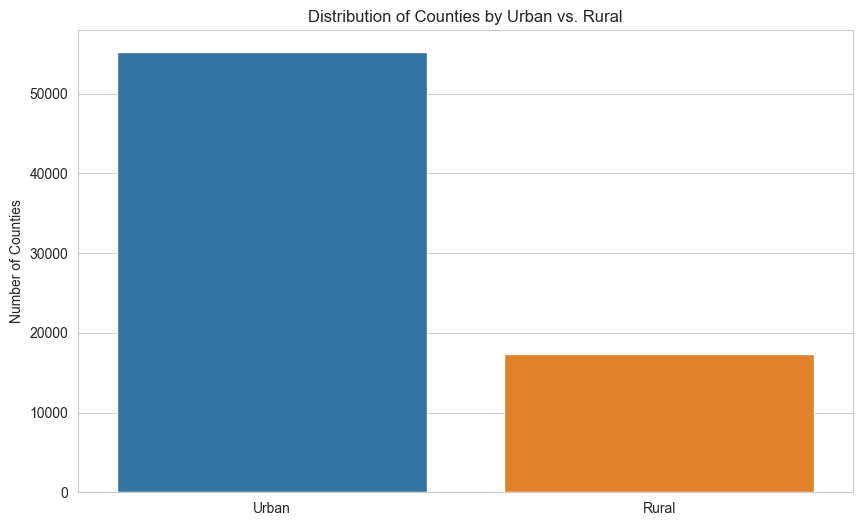
    


```python
FoodAccess_count = FD.groupby('LowFoodAccess')[['Urban_Status']].count()
print("Food Access by Urban Status:")
print(Urban_count)
# Food Access Classification
sns.countplot(data=FD, x="LowFoodAccess", hue="LowFoodAccess")
plt.title("Counties with Low Food Access")
plt.xlabel("Low Food Access")
plt.ylabel("Number of Counties")
plt.show()

```

    Food Access by Urban Status:
                  LowFoodAccess
    Urban_Status               
    Rural                 17362
    Urban                 55169
    


    
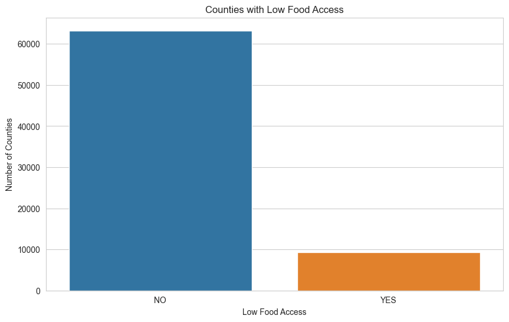
    


```python
#2x2 table (contingency table / cross-tabulation)

Urban_contingency_table = pd.crosstab(FD["LowFoodAccess"], FD["Urban_Status"])

print("Contingency Table (LowFoodAccess vs Urban_Status):")
print(Urban_contingency_table)
```

    Contingency Table (LowFoodAccess vs Urban_Status):
    Urban_Status   Rural  Urban
    LowFoodAccess              
    NO             16010  47228
    YES             1352   7941
    


```python
plt.figure(figsize=(8,5))
sns.countplot(data=FD, x='Urban_Status', hue='LowFoodAccess', 
             palette={'YES':'salmon', 'NO':'lightgreen'})
plt.title('Food Deserts in Urban vs Rural Areas')
plt.xlabel(None)
plt.ylabel('Frequency')
plt.legend(title='Food Desert')
plt.show()
```


    
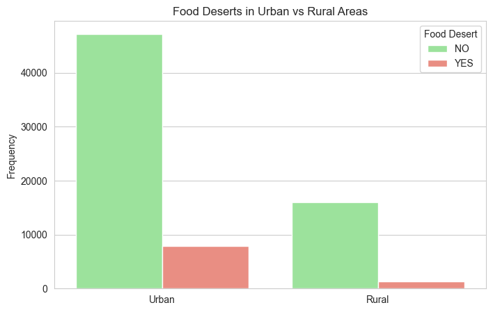
    


###  Defining Key Questions to Answer

#### Food Access and Population Impact
Which states have the largest populations affected by low food access, and what proportion of their population is impacted? (Building on previous work)
How does low food access vary between urban and rural areas in terms of affected population and proportion?
#### Socioeconomic Factors
Is there a relationship between low food access and poverty or income inequality?
How does vehicle ownership (or lack thereof) correlate with low food access?
#### Health Outcomes
Are areas with low food access associated with worse health outcomes, such as higher obesity or diabetes rates?
Is there a link between low food access and premature death rates?
#### Geographic and Demographic Patterns
Which counties within a specific state (e.g., top-affected state) have the most severe food access issues?
Does SNAP (food assistance) participation correlate with low food access or low-income populations?
These questions will guide our analysis, helping us uncover actionable insights while demonstrating a range of data analysis techniques.

## Population-Weighted Analysis of Food Access

### Question 1: States with Largest Affected Populations and Proportions


```python
# Filter low food access(LFA) tracts
LFA_tract = FD[FD["LowFoodAccess"] == "YES"]
# Total population with low food access(LFA) by state
FD["Total_Population"]
LFA_by_state = LFA_tract.groupby("State")["Total_Population"].sum()
#Total pop by state
total_pop_by_state = FD.groupby("State")["Total_Population"].sum()
# Proportion of pop with low food access(LFA)
LFA_prop = (LFA_by_state/total_pop_by_state*100).sort_values(ascending=False).round(decimals=1)
```


```python
LFA_tract
```


<div>
<style scoped>
    .dataframe tbody tr th:only-of-type {
        vertical-align: middle;
    }

    .dataframe tbody tr th {
        vertical-align: top;
    }

    .dataframe thead th {
        text-align: right;
    }
</style>
<table border="1" class="dataframe">
  <thead>
    <tr style="text-align: right;">
      <th></th>
      <th>Tract_ID</th>
      <th>fipscode</th>
      <th>State</th>
      <th>County</th>
      <th>Urban_Status</th>
      <th>LowFoodAccess</th>
      <th>Total_Population</th>
      <th>LowAccess_Pop</th>
      <th>LowIncome_Pop</th>
      <th>LowIncome&amp;_LowAccess_Pop</th>
      <th>...</th>
      <th>NoVehicle_HHs_Ratio</th>
      <th>SNAP_Participatio_Rate</th>
      <th>premature_death</th>
      <th>poor_health</th>
      <th>low_birthweight</th>
      <th>obesity</th>
      <th>diabetes</th>
      <th>unemployment</th>
      <th>child_poverty</th>
      <th>income_inequality</th>
    </tr>
  </thead>
  <tbody>
    <tr>
      <th>1</th>
      <td>1001020200</td>
      <td>1001</td>
      <td>Alabama</td>
      <td>Autauga County</td>
      <td>Urban</td>
      <td>YES</td>
      <td>2170</td>
      <td>1261.0</td>
      <td>802.0</td>
      <td>604.0</td>
      <td>...</td>
      <td>0.041014</td>
      <td>0.071889</td>
      <td>9778.1</td>
      <td>0.2586</td>
      <td>0.088300</td>
      <td>0.300</td>
      <td>0.8149</td>
      <td>0.046</td>
      <td>0.138</td>
      <td>40.7</td>
    </tr>
    <tr>
      <th>5</th>
      <td>1001020600</td>
      <td>1001</td>
      <td>Alabama</td>
      <td>Autauga County</td>
      <td>Urban</td>
      <td>YES</td>
      <td>3668</td>
      <td>3438.0</td>
      <td>1659.0</td>
      <td>1585.0</td>
      <td>...</td>
      <td>0.019357</td>
      <td>0.061069</td>
      <td>9778.1</td>
      <td>0.2586</td>
      <td>0.088300</td>
      <td>0.300</td>
      <td>0.8149</td>
      <td>0.046</td>
      <td>0.138</td>
      <td>40.7</td>
    </tr>
    <tr>
      <th>6</th>
      <td>1001020700</td>
      <td>1001</td>
      <td>Alabama</td>
      <td>Autauga County</td>
      <td>Urban</td>
      <td>YES</td>
      <td>2891</td>
      <td>1231.0</td>
      <td>2175.0</td>
      <td>742.0</td>
      <td>...</td>
      <td>0.011761</td>
      <td>0.134901</td>
      <td>9778.1</td>
      <td>0.2586</td>
      <td>0.088300</td>
      <td>0.300</td>
      <td>0.8149</td>
      <td>0.046</td>
      <td>0.138</td>
      <td>40.7</td>
    </tr>
    <tr>
      <th>10</th>
      <td>1001021000</td>
      <td>1001</td>
      <td>Alabama</td>
      <td>Autauga County</td>
      <td>Rural</td>
      <td>YES</td>
      <td>2894</td>
      <td>2338.0</td>
      <td>977.0</td>
      <td>902.0</td>
      <td>...</td>
      <td>0.003110</td>
      <td>0.050449</td>
      <td>9778.1</td>
      <td>0.2586</td>
      <td>0.088300</td>
      <td>0.300</td>
      <td>0.8149</td>
      <td>0.046</td>
      <td>0.138</td>
      <td>40.7</td>
    </tr>
    <tr>
      <th>11</th>
      <td>1001021100</td>
      <td>1001</td>
      <td>Alabama</td>
      <td>Autauga County</td>
      <td>Rural</td>
      <td>YES</td>
      <td>3320</td>
      <td>2640.0</td>
      <td>1463.0</td>
      <td>1354.0</td>
      <td>...</td>
      <td>0.081024</td>
      <td>0.069277</td>
      <td>9778.1</td>
      <td>0.2586</td>
      <td>0.088300</td>
      <td>0.300</td>
      <td>0.8149</td>
      <td>0.046</td>
      <td>0.138</td>
      <td>40.7</td>
    </tr>
    <tr>
      <th>...</th>
      <td>...</td>
      <td>...</td>
      <td>...</td>
      <td>...</td>
      <td>...</td>
      <td>...</td>
      <td>...</td>
      <td>...</td>
      <td>...</td>
      <td>...</td>
      <td>...</td>
      <td>...</td>
      <td>...</td>
      <td>...</td>
      <td>...</td>
      <td>...</td>
      <td>...</td>
      <td>...</td>
      <td>...</td>
      <td>...</td>
      <td>...</td>
    </tr>
    <tr>
      <th>72455</th>
      <td>56021000700</td>
      <td>56021</td>
      <td>Wyoming</td>
      <td>Laramie County</td>
      <td>Urban</td>
      <td>YES</td>
      <td>4338</td>
      <td>4162.0</td>
      <td>1772.0</td>
      <td>2004.0</td>
      <td>...</td>
      <td>0.101890</td>
      <td>0.063624</td>
      <td>7837.0</td>
      <td>0.1187</td>
      <td>0.094000</td>
      <td>0.242</td>
      <td>0.8055</td>
      <td>0.039</td>
      <td>0.118</td>
      <td>39.9</td>
    </tr>
    <tr>
      <th>72465</th>
      <td>56021001502</td>
      <td>56021</td>
      <td>Wyoming</td>
      <td>Laramie County</td>
      <td>Urban</td>
      <td>YES</td>
      <td>4899</td>
      <td>1627.0</td>
      <td>1857.0</td>
      <td>601.0</td>
      <td>...</td>
      <td>0.032456</td>
      <td>0.050623</td>
      <td>7837.0</td>
      <td>0.1187</td>
      <td>0.094000</td>
      <td>0.242</td>
      <td>0.8055</td>
      <td>0.039</td>
      <td>0.118</td>
      <td>39.9</td>
    </tr>
    <tr>
      <th>72473</th>
      <td>56025000200</td>
      <td>56025</td>
      <td>Wyoming</td>
      <td>Natrona County</td>
      <td>Urban</td>
      <td>YES</td>
      <td>4385</td>
      <td>4137.0</td>
      <td>1946.0</td>
      <td>2078.0</td>
      <td>...</td>
      <td>0.074116</td>
      <td>0.080730</td>
      <td>8175.6</td>
      <td>0.1301</td>
      <td>0.072000</td>
      <td>0.250</td>
      <td>0.7888</td>
      <td>0.029</td>
      <td>0.137</td>
      <td>42.3</td>
    </tr>
    <tr>
      <th>72491</th>
      <td>56027957200</td>
      <td>56027</td>
      <td>Wyoming</td>
      <td>Niobrara County</td>
      <td>Rural</td>
      <td>YES</td>
      <td>2484</td>
      <td>545.0</td>
      <td>941.0</td>
      <td>230.0</td>
      <td>...</td>
      <td>0.012882</td>
      <td>0.022142</td>
      <td>10210.6</td>
      <td>0.0882</td>
      <td>0.080252</td>
      <td>0.268</td>
      <td>0.7826</td>
      <td>0.038</td>
      <td>0.164</td>
      <td>43.3</td>
    </tr>
    <tr>
      <th>72497</th>
      <td>56031959100</td>
      <td>56031</td>
      <td>Wyoming</td>
      <td>Platte County</td>
      <td>Rural</td>
      <td>YES</td>
      <td>2092</td>
      <td>630.0</td>
      <td>758.0</td>
      <td>180.0</td>
      <td>...</td>
      <td>0.014818</td>
      <td>0.028203</td>
      <td>7985.4</td>
      <td>0.1071</td>
      <td>0.092900</td>
      <td>0.224</td>
      <td>0.7692</td>
      <td>0.041</td>
      <td>0.190</td>
      <td>41.3</td>
    </tr>
  </tbody>
</table>
<p>9293 rows × 27 columns</p>
</div>


```python
LFA_by_state
total_pop_by_state
LFA_prop
```


    State
    Mississippi             29.8
    New Mexico              26.6
    Arkansas                24.0
    Louisiana               22.3
    Georgia                 22.3
    Texas                   19.6
    Alabama                 19.0
    South Carolina          18.9
    Missouri                18.1
    Tennessee               17.9
    Indiana                 17.5
    Kansas                  17.2
    North Carolina          16.7
    Arizona                 16.4
    Oklahoma                16.1
    South Dakota            14.8
    Delaware                14.5
    Virginia                14.3
    Minnesota               13.9
    Alaska                  13.6
    Florida                 13.5
    West Virginia           13.5
    Colorado                13.2
    Kentucky                13.2
    New Hampshire           13.1
    Ohio                    13.0
    Oregon                  12.9
    Idaho                   12.5
    Montana                 12.3
    Washington              12.3
    Michigan                11.4
    Nebraska                11.0
    Hawaii                  10.3
    Iowa                    10.3
    Illinois                 9.7
    Maryland                 9.6
    Wisconsin                8.9
    Connecticut              8.9
    Wyoming                  8.8
    Utah                     8.5
    Massachusetts            8.3
    North Dakota             7.9
    Maine                    7.6
    Vermont                  7.4
    California               7.2
    Nevada                   7.0
    Pennsylvania             6.3
    District of Columbia     5.9
    Rhode Island             5.4
    New Jersey               5.2
    New York                 3.9
    Name: Total_Population, dtype: float64


```python
# Combine into a single dataframe
state_summary = pd.DataFrame({
    "LFA_Population" : LFA_by_state,
    "Total_Population" : total_pop_by_state,
    "LFA_Percentage (%)": LFA_prop
}).sort_values(by="LFA_Population", ascending=False)
```


```python
state_summary
```


<div>
<style scoped>
    .dataframe tbody tr th:only-of-type {
        vertical-align: middle;
    }

    .dataframe tbody tr th {
        vertical-align: top;
    }

    .dataframe thead th {
        text-align: right;
    }
</style>
<table border="1" class="dataframe">
  <thead>
    <tr style="text-align: right;">
      <th></th>
      <th>LFA_Population</th>
      <th>Total_Population</th>
      <th>LFA_Percentage (%)</th>
    </tr>
    <tr>
      <th>State</th>
      <th></th>
      <th></th>
      <th></th>
    </tr>
  </thead>
  <tbody>
    <tr>
      <th>Texas</th>
      <td>4926344</td>
      <td>25145561</td>
      <td>19.6</td>
    </tr>
    <tr>
      <th>California</th>
      <td>2669879</td>
      <td>37253956</td>
      <td>7.2</td>
    </tr>
    <tr>
      <th>Florida</th>
      <td>2546335</td>
      <td>18801310</td>
      <td>13.5</td>
    </tr>
    <tr>
      <th>Georgia</th>
      <td>2158463</td>
      <td>9687653</td>
      <td>22.3</td>
    </tr>
    <tr>
      <th>North Carolina</th>
      <td>1593822</td>
      <td>9535483</td>
      <td>16.7</td>
    </tr>
    <tr>
      <th>Ohio</th>
      <td>1504341</td>
      <td>11536504</td>
      <td>13.0</td>
    </tr>
    <tr>
      <th>Illinois</th>
      <td>1242939</td>
      <td>12830632</td>
      <td>9.7</td>
    </tr>
    <tr>
      <th>Virginia</th>
      <td>1147233</td>
      <td>8001024</td>
      <td>14.3</td>
    </tr>
    <tr>
      <th>Indiana</th>
      <td>1135595</td>
      <td>6483802</td>
      <td>17.5</td>
    </tr>
    <tr>
      <th>Tennessee</th>
      <td>1134333</td>
      <td>6346105</td>
      <td>17.9</td>
    </tr>
    <tr>
      <th>Michigan</th>
      <td>1131629</td>
      <td>9883640</td>
      <td>11.4</td>
    </tr>
    <tr>
      <th>Missouri</th>
      <td>1084564</td>
      <td>5988927</td>
      <td>18.1</td>
    </tr>
    <tr>
      <th>Arizona</th>
      <td>1049466</td>
      <td>6392017</td>
      <td>16.4</td>
    </tr>
    <tr>
      <th>Louisiana</th>
      <td>1010836</td>
      <td>4533372</td>
      <td>22.3</td>
    </tr>
    <tr>
      <th>Alabama</th>
      <td>908205</td>
      <td>4779736</td>
      <td>19.0</td>
    </tr>
    <tr>
      <th>Mississippi</th>
      <td>884934</td>
      <td>2967297</td>
      <td>29.8</td>
    </tr>
    <tr>
      <th>South Carolina</th>
      <td>872233</td>
      <td>4625364</td>
      <td>18.9</td>
    </tr>
    <tr>
      <th>Washington</th>
      <td>825837</td>
      <td>6724540</td>
      <td>12.3</td>
    </tr>
    <tr>
      <th>Pennsylvania</th>
      <td>800303</td>
      <td>12702379</td>
      <td>6.3</td>
    </tr>
    <tr>
      <th>New York</th>
      <td>757797</td>
      <td>19378102</td>
      <td>3.9</td>
    </tr>
    <tr>
      <th>Minnesota</th>
      <td>737593</td>
      <td>5303925</td>
      <td>13.9</td>
    </tr>
    <tr>
      <th>Arkansas</th>
      <td>698688</td>
      <td>2915918</td>
      <td>24.0</td>
    </tr>
    <tr>
      <th>Colorado</th>
      <td>663246</td>
      <td>5029196</td>
      <td>13.2</td>
    </tr>
    <tr>
      <th>Oklahoma</th>
      <td>602480</td>
      <td>3751351</td>
      <td>16.1</td>
    </tr>
    <tr>
      <th>Kentucky</th>
      <td>571751</td>
      <td>4339367</td>
      <td>13.2</td>
    </tr>
    <tr>
      <th>Maryland</th>
      <td>552017</td>
      <td>5773552</td>
      <td>9.6</td>
    </tr>
    <tr>
      <th>New Mexico</th>
      <td>547468</td>
      <td>2059179</td>
      <td>26.6</td>
    </tr>
    <tr>
      <th>Massachusetts</th>
      <td>541476</td>
      <td>6547629</td>
      <td>8.3</td>
    </tr>
    <tr>
      <th>Wisconsin</th>
      <td>505977</td>
      <td>5686986</td>
      <td>8.9</td>
    </tr>
    <tr>
      <th>Oregon</th>
      <td>494475</td>
      <td>3831074</td>
      <td>12.9</td>
    </tr>
    <tr>
      <th>Kansas</th>
      <td>491894</td>
      <td>2853118</td>
      <td>17.2</td>
    </tr>
    <tr>
      <th>New Jersey</th>
      <td>459081</td>
      <td>8791894</td>
      <td>5.2</td>
    </tr>
    <tr>
      <th>Connecticut</th>
      <td>317446</td>
      <td>3574097</td>
      <td>8.9</td>
    </tr>
    <tr>
      <th>Iowa</th>
      <td>313703</td>
      <td>3046355</td>
      <td>10.3</td>
    </tr>
    <tr>
      <th>West Virginia</th>
      <td>250113</td>
      <td>1852994</td>
      <td>13.5</td>
    </tr>
    <tr>
      <th>Utah</th>
      <td>234217</td>
      <td>2763885</td>
      <td>8.5</td>
    </tr>
    <tr>
      <th>Nebraska</th>
      <td>200184</td>
      <td>1826341</td>
      <td>11.0</td>
    </tr>
    <tr>
      <th>Idaho</th>
      <td>195299</td>
      <td>1567582</td>
      <td>12.5</td>
    </tr>
    <tr>
      <th>Nevada</th>
      <td>188652</td>
      <td>2700551</td>
      <td>7.0</td>
    </tr>
    <tr>
      <th>New Hampshire</th>
      <td>172797</td>
      <td>1316470</td>
      <td>13.1</td>
    </tr>
    <tr>
      <th>Hawaii</th>
      <td>140491</td>
      <td>1360301</td>
      <td>10.3</td>
    </tr>
    <tr>
      <th>Delaware</th>
      <td>129852</td>
      <td>897934</td>
      <td>14.5</td>
    </tr>
    <tr>
      <th>Montana</th>
      <td>122057</td>
      <td>989415</td>
      <td>12.3</td>
    </tr>
    <tr>
      <th>South Dakota</th>
      <td>120657</td>
      <td>814180</td>
      <td>14.8</td>
    </tr>
    <tr>
      <th>Maine</th>
      <td>100822</td>
      <td>1328361</td>
      <td>7.6</td>
    </tr>
    <tr>
      <th>Alaska</th>
      <td>96841</td>
      <td>710231</td>
      <td>13.6</td>
    </tr>
    <tr>
      <th>Rhode Island</th>
      <td>56721</td>
      <td>1052567</td>
      <td>5.4</td>
    </tr>
    <tr>
      <th>North Dakota</th>
      <td>52813</td>
      <td>672591</td>
      <td>7.9</td>
    </tr>
    <tr>
      <th>Wyoming</th>
      <td>49592</td>
      <td>563626</td>
      <td>8.8</td>
    </tr>
    <tr>
      <th>Vermont</th>
      <td>46079</td>
      <td>625741</td>
      <td>7.4</td>
    </tr>
    <tr>
      <th>District of Columbia</th>
      <td>35404</td>
      <td>601723</td>
      <td>5.9</td>
    </tr>
  </tbody>
</table>
</div>


```python
print(f"Top 10 States by Low food Access Population and Proportion: \n{state_summary.head(10)}")
```

    Top 10 States by Low food Access Population and Proportion: 
                    LFA_Population  Total_Population  LFA_Percentage (%)
    State                                                               
    Texas                  4926344          25145561                19.6
    California             2669879          37253956                 7.2
    Florida                2546335          18801310                13.5
    Georgia                2158463           9687653                22.3
    North Carolina         1593822           9535483                16.7
    Ohio                   1504341          11536504                13.0
    Illinois               1242939          12830632                 9.7
    Virginia               1147233           8001024                14.3
    Indiana                1135595           6483802                17.5
    Tennessee              1134333           6346105                17.9
    


```python
# Bar plot for population
top_10_states = state_summary.head(10)
plt.figure(figsize=(12, 6))
sns.barplot(data=top_10_states, x = "State", y = "LFA_Population")
plt.xlabel("Sate")
plt.ylabel("Number of People with Low Food Access (in Millions)")
plt.title("Top 10 States by Population with Low Food Access")
```


    Text(0.5, 1.0, 'Top 10 States by Population with Low Food Access')


    
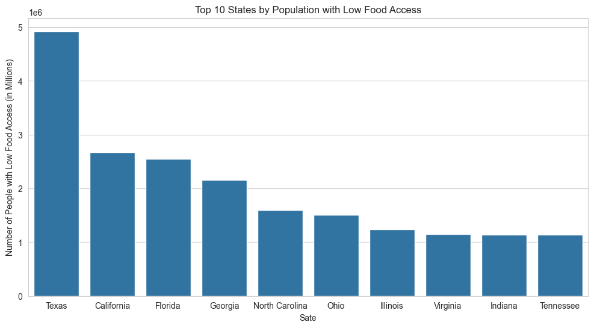
    


Create a twin Axes sharing the xaxis.

Create a new Axes with an invisible x-axis and an independent y-axis positioned opposite to the original one (i.e. at right). The x-axis autoscale setting will be inherited from the original Axes. To ensure that the tick marks of both y-axes align, see ~matplotlib.ticker.LinearLocator.


```python
state_summary
```


<div>
<style scoped>
    .dataframe tbody tr th:only-of-type {
        vertical-align: middle;
    }

    .dataframe tbody tr th {
        vertical-align: top;
    }

    .dataframe thead th {
        text-align: right;
    }
</style>
<table border="1" class="dataframe">
  <thead>
    <tr style="text-align: right;">
      <th></th>
      <th>LFA_Population</th>
      <th>Total_Population</th>
      <th>LFA_Percentage (%)</th>
    </tr>
    <tr>
      <th>State</th>
      <th></th>
      <th></th>
      <th></th>
    </tr>
  </thead>
  <tbody>
    <tr>
      <th>Texas</th>
      <td>4926344</td>
      <td>25145561</td>
      <td>19.6</td>
    </tr>
    <tr>
      <th>California</th>
      <td>2669879</td>
      <td>37253956</td>
      <td>7.2</td>
    </tr>
    <tr>
      <th>Florida</th>
      <td>2546335</td>
      <td>18801310</td>
      <td>13.5</td>
    </tr>
    <tr>
      <th>Georgia</th>
      <td>2158463</td>
      <td>9687653</td>
      <td>22.3</td>
    </tr>
    <tr>
      <th>North Carolina</th>
      <td>1593822</td>
      <td>9535483</td>
      <td>16.7</td>
    </tr>
    <tr>
      <th>Ohio</th>
      <td>1504341</td>
      <td>11536504</td>
      <td>13.0</td>
    </tr>
    <tr>
      <th>Illinois</th>
      <td>1242939</td>
      <td>12830632</td>
      <td>9.7</td>
    </tr>
    <tr>
      <th>Virginia</th>
      <td>1147233</td>
      <td>8001024</td>
      <td>14.3</td>
    </tr>
    <tr>
      <th>Indiana</th>
      <td>1135595</td>
      <td>6483802</td>
      <td>17.5</td>
    </tr>
    <tr>
      <th>Tennessee</th>
      <td>1134333</td>
      <td>6346105</td>
      <td>17.9</td>
    </tr>
    <tr>
      <th>Michigan</th>
      <td>1131629</td>
      <td>9883640</td>
      <td>11.4</td>
    </tr>
    <tr>
      <th>Missouri</th>
      <td>1084564</td>
      <td>5988927</td>
      <td>18.1</td>
    </tr>
    <tr>
      <th>Arizona</th>
      <td>1049466</td>
      <td>6392017</td>
      <td>16.4</td>
    </tr>
    <tr>
      <th>Louisiana</th>
      <td>1010836</td>
      <td>4533372</td>
      <td>22.3</td>
    </tr>
    <tr>
      <th>Alabama</th>
      <td>908205</td>
      <td>4779736</td>
      <td>19.0</td>
    </tr>
    <tr>
      <th>Mississippi</th>
      <td>884934</td>
      <td>2967297</td>
      <td>29.8</td>
    </tr>
    <tr>
      <th>South Carolina</th>
      <td>872233</td>
      <td>4625364</td>
      <td>18.9</td>
    </tr>
    <tr>
      <th>Washington</th>
      <td>825837</td>
      <td>6724540</td>
      <td>12.3</td>
    </tr>
    <tr>
      <th>Pennsylvania</th>
      <td>800303</td>
      <td>12702379</td>
      <td>6.3</td>
    </tr>
    <tr>
      <th>New York</th>
      <td>757797</td>
      <td>19378102</td>
      <td>3.9</td>
    </tr>
    <tr>
      <th>Minnesota</th>
      <td>737593</td>
      <td>5303925</td>
      <td>13.9</td>
    </tr>
    <tr>
      <th>Arkansas</th>
      <td>698688</td>
      <td>2915918</td>
      <td>24.0</td>
    </tr>
    <tr>
      <th>Colorado</th>
      <td>663246</td>
      <td>5029196</td>
      <td>13.2</td>
    </tr>
    <tr>
      <th>Oklahoma</th>
      <td>602480</td>
      <td>3751351</td>
      <td>16.1</td>
    </tr>
    <tr>
      <th>Kentucky</th>
      <td>571751</td>
      <td>4339367</td>
      <td>13.2</td>
    </tr>
    <tr>
      <th>Maryland</th>
      <td>552017</td>
      <td>5773552</td>
      <td>9.6</td>
    </tr>
    <tr>
      <th>New Mexico</th>
      <td>547468</td>
      <td>2059179</td>
      <td>26.6</td>
    </tr>
    <tr>
      <th>Massachusetts</th>
      <td>541476</td>
      <td>6547629</td>
      <td>8.3</td>
    </tr>
    <tr>
      <th>Wisconsin</th>
      <td>505977</td>
      <td>5686986</td>
      <td>8.9</td>
    </tr>
    <tr>
      <th>Oregon</th>
      <td>494475</td>
      <td>3831074</td>
      <td>12.9</td>
    </tr>
    <tr>
      <th>Kansas</th>
      <td>491894</td>
      <td>2853118</td>
      <td>17.2</td>
    </tr>
    <tr>
      <th>New Jersey</th>
      <td>459081</td>
      <td>8791894</td>
      <td>5.2</td>
    </tr>
    <tr>
      <th>Connecticut</th>
      <td>317446</td>
      <td>3574097</td>
      <td>8.9</td>
    </tr>
    <tr>
      <th>Iowa</th>
      <td>313703</td>
      <td>3046355</td>
      <td>10.3</td>
    </tr>
    <tr>
      <th>West Virginia</th>
      <td>250113</td>
      <td>1852994</td>
      <td>13.5</td>
    </tr>
    <tr>
      <th>Utah</th>
      <td>234217</td>
      <td>2763885</td>
      <td>8.5</td>
    </tr>
    <tr>
      <th>Nebraska</th>
      <td>200184</td>
      <td>1826341</td>
      <td>11.0</td>
    </tr>
    <tr>
      <th>Idaho</th>
      <td>195299</td>
      <td>1567582</td>
      <td>12.5</td>
    </tr>
    <tr>
      <th>Nevada</th>
      <td>188652</td>
      <td>2700551</td>
      <td>7.0</td>
    </tr>
    <tr>
      <th>New Hampshire</th>
      <td>172797</td>
      <td>1316470</td>
      <td>13.1</td>
    </tr>
    <tr>
      <th>Hawaii</th>
      <td>140491</td>
      <td>1360301</td>
      <td>10.3</td>
    </tr>
    <tr>
      <th>Delaware</th>
      <td>129852</td>
      <td>897934</td>
      <td>14.5</td>
    </tr>
    <tr>
      <th>Montana</th>
      <td>122057</td>
      <td>989415</td>
      <td>12.3</td>
    </tr>
    <tr>
      <th>South Dakota</th>
      <td>120657</td>
      <td>814180</td>
      <td>14.8</td>
    </tr>
    <tr>
      <th>Maine</th>
      <td>100822</td>
      <td>1328361</td>
      <td>7.6</td>
    </tr>
    <tr>
      <th>Alaska</th>
      <td>96841</td>
      <td>710231</td>
      <td>13.6</td>
    </tr>
    <tr>
      <th>Rhode Island</th>
      <td>56721</td>
      <td>1052567</td>
      <td>5.4</td>
    </tr>
    <tr>
      <th>North Dakota</th>
      <td>52813</td>
      <td>672591</td>
      <td>7.9</td>
    </tr>
    <tr>
      <th>Wyoming</th>
      <td>49592</td>
      <td>563626</td>
      <td>8.8</td>
    </tr>
    <tr>
      <th>Vermont</th>
      <td>46079</td>
      <td>625741</td>
      <td>7.4</td>
    </tr>
    <tr>
      <th>District of Columbia</th>
      <td>35404</td>
      <td>601723</td>
      <td>5.9</td>
    </tr>
  </tbody>
</table>
</div>


```python
# Dual-axis visualization for top 10 states by population
# Create figure and primary axes
#fig, ax1 = plt.subplots() 
fig, ax1 = plt.subplots()
sns.barplot(data=top_10_states, x = "State", y = "LFA_Population", ax = ax1, color="blue")
ax1.set_ylabel("Number of People with Low Food Access(Millions)", color = "blue")
ax2 = ax1.twinx()
sns.lineplot(data=top_10_states, x = "State", y=top_10_states["LFA_Percentage (%)"], ax= ax2, color = "red",marker="o")
ax2.set_ylabel("Percentage of People with Low Food Access", color ="red")
plt.title("Top 10 State: Low food Access")
fig.tight_layout()
plt.show()

```


    
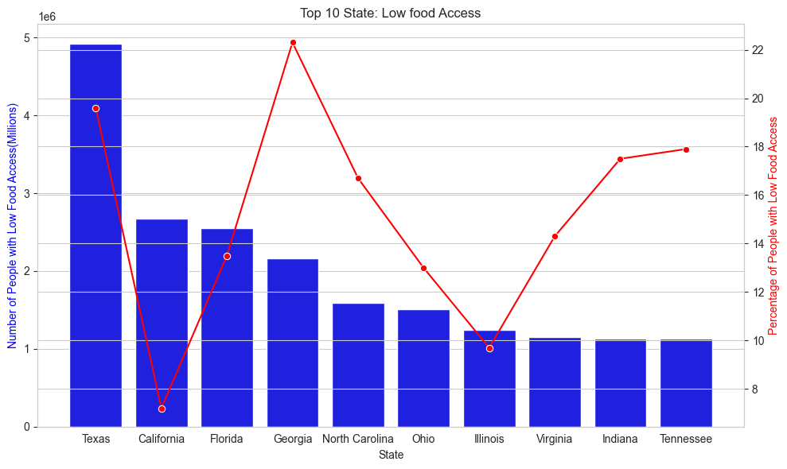
    


### Question 2: Urban vs. Rural Impact


```python
#  Filter low food access(LFA) tracts
# LFA_tract = FD[FD["LowFoodAccess"] == "YES"]
# Population with low food access by urban status
# Total population with low food access(LFA) by urban status
LFA_Pop_by_UrbanStatus = LFA_tract.groupby("Urban_Status")["Total_Population"].sum()
#Total pop by Urban_Status
Total_Pop_by_UrbanStatus = FD.groupby("Urban_Status")["Total_Population"].sum()
# Proportion of pop with low food access(LFA)  based on Urban_Status
LFA_Prop_Urban = (LFA_Pop_by_UrbanStatus/Total_Pop_by_UrbanStatus*100)

# Combine into a single dataframe
urban_summary = pd.DataFrame({
    "Low_Food_Access_Pop" : LFA_Pop_by_UrbanStatus,
    'Proportion (%)': LFA_Prop_Urban
})
# Display combined results
print("Urban vs. Rural Low Food Access:")
print(urban_summary)
# Stacked bar plot with proportion annotation
fig, ax1 = plt.subplots()
sns.barplot(data=urban_summary, x = "Urban_Status", y = "Low_Food_Access_Pop", hue="Urban_Status", ax =ax1)
ax1.set_ylabel("Number of People with Low Food Access (10 X Millions)")
ax1.set(xlabel=None)
ax2=ax1.twinx()
sns.lineplot(data=urban_summary, x = "Urban_Status", y = urban_summary["Proportion (%)"], ax =ax2,color = "darkgreen", marker="o")
ax2.set_ylabel("Percentage of People with Low Food Access", color = "darkgreen")
```

    Urban vs. Rural Low Food Access:
                  Low_Food_Access_Pop  Proportion (%)
    Urban_Status                                     
    Rural                     4673301        6.584775
    Urban                    34401673       14.468209
    


    Text(0, 0.5, 'Percentage of People with Low Food Access')


    
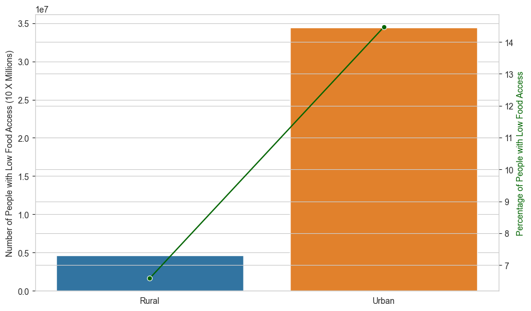
    


```python
LFA_Pop_by_UrbanStatus
Total_Pop_by_UrbanStatus
```


    Urban_Status
    Rural     70971304
    Urban    237774234
    Name: Total_Population, dtype: int64


##  Socioeconomic Analysis & Health Outcomes

### Question 3: Food Access: Probable Causes and Consequences (Correlation Analysis)


```python
#Add ratios columns 
FD["LFA_Rate"] = FD["LowAccess_Pop"] / FD["Total_Population"] * 100
FD["SNAP_Rate"] = FD["SNAP_HHs"] / FD["Total_Population"] * 100
FD["NoVehicle_Rate"] = FD["NoVehicle_HHs"] / FD["Total_Population"] * 100


# Select food access (LFA_Rate), its probable causes, and consequences columns
FD.columns
numeric_cols = FD[['Poverty_Rate',
       'Median_Income', 'premature_death', 'poor_health', 'low_birthweight',
       'obesity', 'diabetes', 'unemployment', 'child_poverty',
       'income_inequality', 'LFA_Rate', 'SNAP_Rate', 'NoVehicle_Rate']]

# Compute correlation matrix
corr = numeric_cols.corr()

# Plot heatmap
plt.figure(figsize=(12, 8))
sns.heatmap(corr, annot=True, fmt=".2f", cmap="coolwarm", linewidths=0.5)
plt.title("Correlation Heatmap of Food Access Variables")
plt.show()
```


    
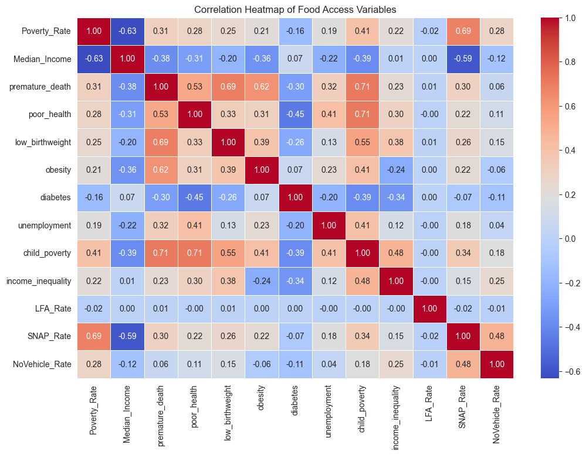
    


Goal: Understand whether low food access (LFA_Rate) is linked to poverty, transportation, and health.

Method:
I used Pearson correlation to test relationships between food access and potential causes (e.g., Poverty_Rate, NoVehicle_Rate) and effects (e.g., obesity).

Findings:

LFA_Rate had very weak or no correlation with poverty, SNAP participation, vehicle access, or obesity.

The strongest relationship found was between:

SNAP_Rate and Poverty_Rate: +0.69

child_poverty and poor_health: +0.71

These reflect clear socioeconomic links, even if food access alone doesn't show up as a major player.
Even though we often assume food deserts lead directly to poor health or are caused by poverty and lack of transportation, this dataset shows that simple linear relationships are limited. Food access is a complex issue influenced by multiple overlapping factors, and correlation alone doesn’t capture the full story.

### Health Outcomes

#### Linking Childhood Poverty to Adult Health: Urban and Rural Perspectives

The scatter plot explores the relationship between two variables:
Proportion of Adults in Poor Health (x-axis) : This represents the percentage of adults in a given area or population who are in poor health.
Proportion of Children in Poverty (y-axis) : This represents the percentage of children in the same area or population who are living in poverty.


```python
# Poor Health vs Child Poverty
sns.scatterplot(data=FD, x="poor_health", y="child_poverty", hue="Urban_Status")
plt.title("Poor Health vs Child Poverty")
plt.xlabel("Proportion of Adults Health Status")
plt.ylabel("Proportion of Children in Poverty ")
plt.show()
```


    
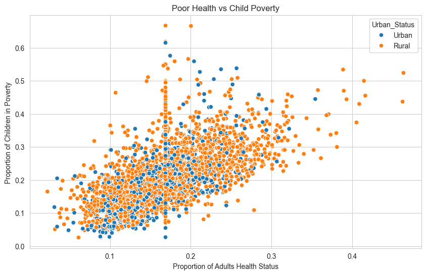
    


#### Question 4: Low Food Access VS. Obesity and Diabetes


```python
# Average health metrics
health_comp = FD.groupby('LowFoodAccess')[['obesity', 'diabetes']].mean()
print("Health Metrics by Food Access:")
print(health_comp)

# Boxplot for obesity
sns.boxplot(data=FD, x='LowFoodAccess', y='obesity', hue="LowFoodAccess")
plt.title('Obesity by Low Food Access')
plt.show()
```

    Health Metrics by Food Access:
                    obesity  diabetes
    LowFoodAccess                    
    NO             0.257326  0.796038
    YES            0.276815  0.791431
    


    
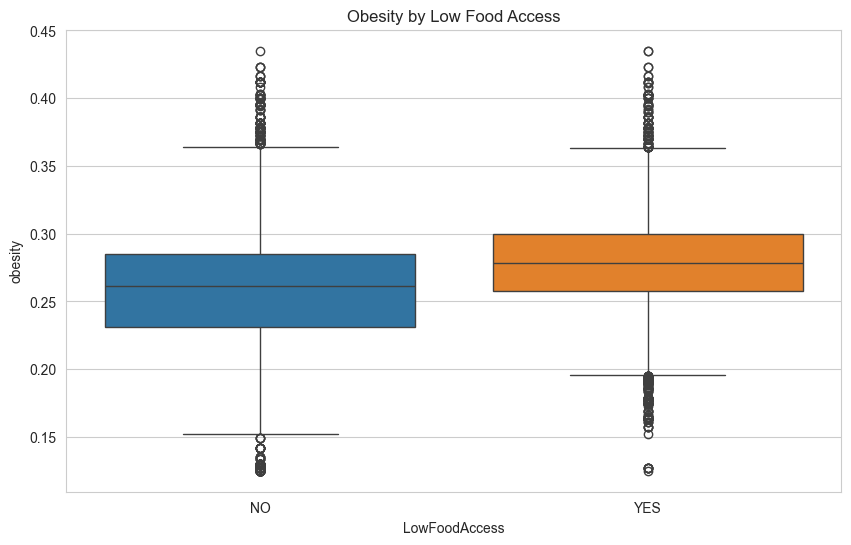
    


```python
# Boxplot for diabetes
sns.boxplot(data=FD, x='LowFoodAccess', y='diabetes', hue="LowFoodAccess")
plt.xlabel("Low Food Access Status")
plt.ylabel("Diabety Rate")
plt.title('Diabetes by Low Food Access')
plt.show()
```


    
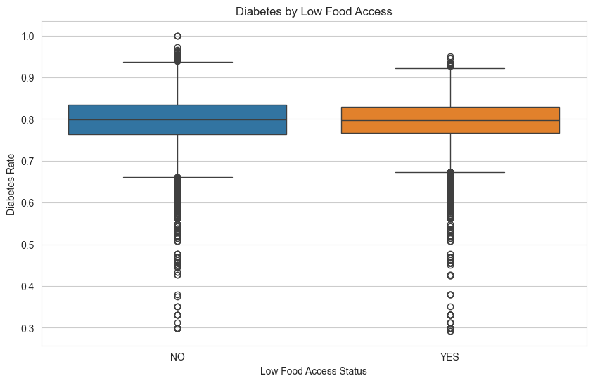
    


## Geographic Drill-Down
### Question 5: County-Level View in Most Affected State


```python
# Get top state and filter data
top_state = state_summary.index[0]
state_data = low_access_tracts[low_access_tracts['State'] == top_state]
county_data = state_data.groupby('County')['Total_Population'].sum().sort_values(ascending=False).head(10)

print(f"Top 10 Counties in {top_state}:")
print(county_data)
```

    Top 10 Counties in Texas:
    County
    Harris County      637644
    Hidalgo County     461260
    Dallas County      441656
    Tarrant County     315695
    Bexar County       315428
    El Paso County     205339
    Cameron County     184305
    Travis County      135025
    Bell County         82490
    McLennan County     68357
    Name: Total_Population, dtype: int64
    


```python
# Generate gradient colors
n_bars = len(county_data)
colors = plt.cm.viridis(np.linspace(0, 1, n_bars)).tolist()  # Convert to list

# Create the plot with correct parameters
ax = sns.barplot(
    x=county_data.values,
    y=county_data.index,
    hue=county_data.index,  # Required now
    palette=colors
)

plt.title(f"Top Counties in {top_state}")
plt.xlabel("Population")
plt.tight_layout()
plt.show()
```


    
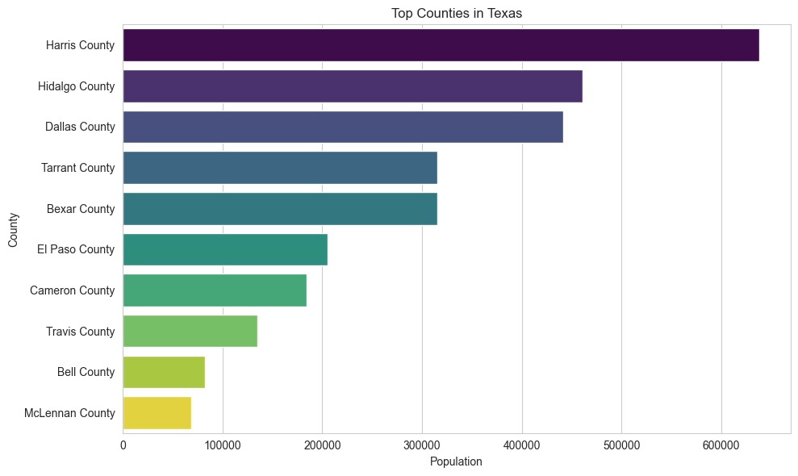
    


## poor_health VS child_poverty

poor_health: Proportion of adults who report being in fair or poor general health, expressed as a value between 0 and 1 (i.e., 0 = no one reports poor health, 1 = everyone reports poor health). 
child_poverty: Proportion of children under age 18 living in households below the federal poverty threshold, expressed as a value between 0 and 1. 


```python
# Poor Health vs Child Poverty
sns.scatterplot(data=FD, x="poor_health", y="child_poverty", hue="Urban_Status")
plt.title("Poor Health vs Child Poverty")
plt.xlabel("Proportion of Adults Health Status")
plt.ylabel("Proportion of Children in Poverty ")
plt.show()
```


    

    


There is a positive correlation between poor health and child poverty, with urban areas showing more variability and rural areas having distinct patterns.
